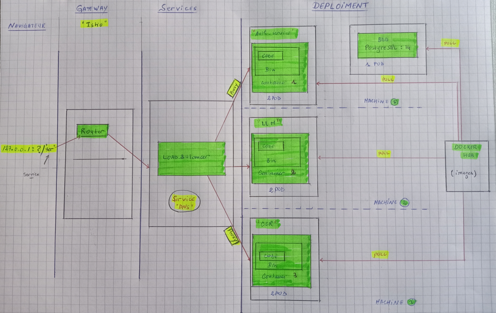
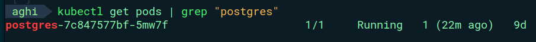
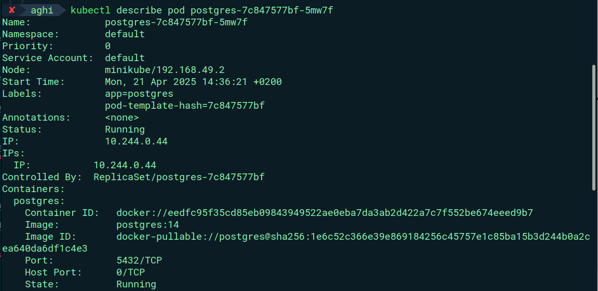
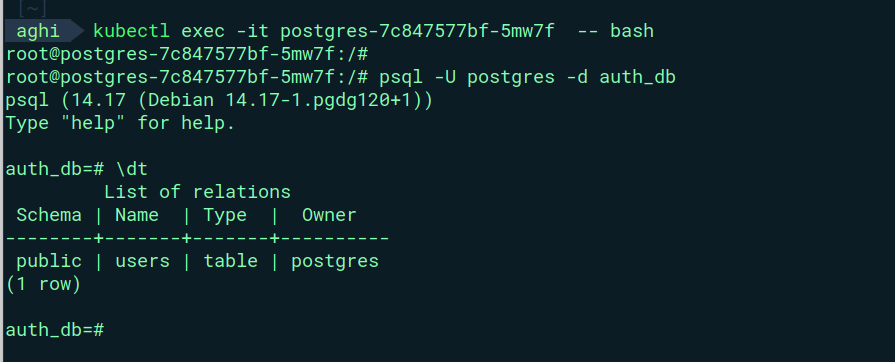
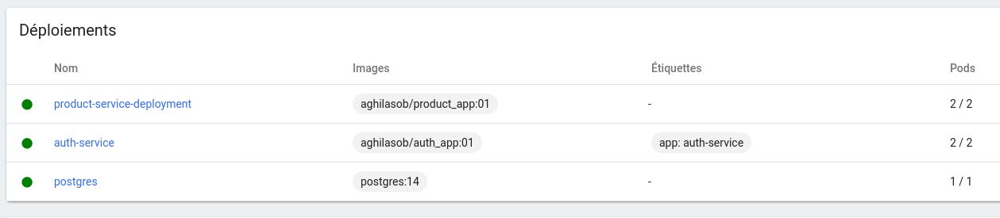
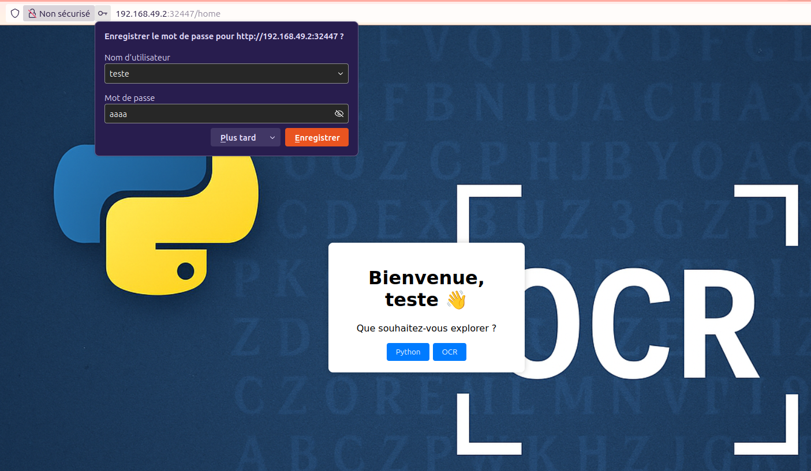
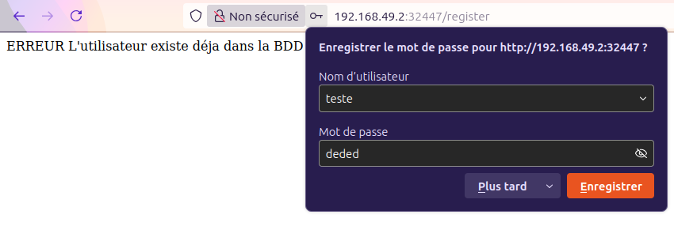
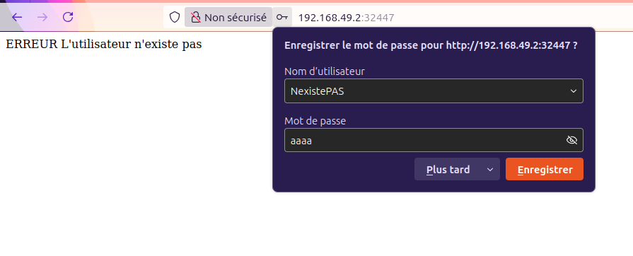

**Auteurs**  
- **Auteur 1** : Sofiane AGOUNI KACI
- **Auteur 2** : Aghilas OULD BRAHAM
  
**Date** : 2024 - 2025

**Groupe** : M1-RSA

****
<h3 align="center">Projet : Microservices</h3>

<p align="center"><i>LLM & OCR</i></p>
<p align="center"
    <a href="https://www.u-paris.fr/">
       
    </a>
</p>
<p align="center">
    <a href="https://docs.pypots.com/en/latest/install.html#reasons-of-version-limitations-on-dependencies">
       
    </a>
    <a href="https://flask.palletsprojects.com/">
       
    </a>
    <a href="https://www.docker.com/">
       
    </a>
    <a href="https://kubernetes.io/">
       
    </a>
    <a href="https://www.postgresql.org/" title="PostgreSQL v14">
   
  </a>
  <a href="https://istio.io/" title="Istio v1.19">
  
  </a>
</p>

****

# Description des microservices

#### Microservice Flask avec PostgreSQL
Ce microservice d’authentification d’utilisateurs développé avec **Flask** et connecté à une base de données **PostgreSQL**. Il permet la gestion sécurisée des comptes utilisateurs via une API REST, avec les fonctionnalités suivantes :
  * **Fonctionnalités principales :**
    * **Inscription d’un nouvel utilisateur** avec vérification des données
    * **Connexion sécurisée** avec gestion de mot de passe haché
    * Base de données relationnelle **PostgreSQL**pour stocker les utilisateurs
    * Migration de la base avec **Flask-Migrate**


  * **Environnement technique :**

    * Conteneurisation avec **Docker** et **orchestration** via **Docker Compose** ou **Kubernetes (Minikube)**
    * Utilisation de **Secrets Kubernetes** pour sécuriser les variables sensibles (DB user, password…)
    * **Service exposé** via un **LoadBalancer** (pour accès depuis l’extérieur)

#### Microservice LLM
Ce microservice expose une API Flask permettant l’envoi de messages à un **LLM via un webhook Make.com** et retourne une réponse contenant du code Python et une explication extraite de la réponse textuelle.
  * **Fonctionnalités principales :**

    * **Interface web** (HTML form ou API) pour envoyer une requête textuelle.
    * Appel à **un webhook** externe (**Make.com**) contenant **un LLM**.
    * Extraction du **code Python** depuis la réponse du **LLM**.
    * Extraction de **l’explication textuelle associée**.
    * Réponse **JSON** contenant **le code extrait** et **son explication**.

  * **Environnement technique :**
    * Framework : Flask (Python)
    * Conteneurisation via **Docker** et déploiment avec **Kubernetes**.
    * Variables sensibles (comme le WEBHOOK_URL) sécurisées avec Kubernetes Secrets.
    * Service exposé via un **LoadBalancer** pour accès depuis l’extérieur.
  
  ````
  Make.com — Plateforme d’Automatisation Visuelle :
  -------------------------------------------------

  Make.com est une plateforme d’automatisation visuelle qui permet de connecter facilement des applications,
    services et API sans écrire de code.

  Elle permet de créer des scénarios (workflows) complexes grâce à une interface glisser-déposer, idéale pour automatiser 
    des processus métiers, envoyer des données entre outils ou intégrer des services externes comme des LLM.
  ````
#### Microservice OCR

Ce microservice permet l’extraction de contenu **LaTeX** à partir de **documents PDF** en utilisant l’API **Gemini AI de Google**.

  * **Fonctionnalités principales :**
  
    * **Interface web** pour **uploader un fichier PDF**.
    * Upload du fichier sur l’API **Gemini AI**.
    * Génération d’un document **LaTeX structuré**, compilable à partir du PDF.
    * Affichage du **code LaTeX généré**.

  * **Environnement technique :**

    * Framework : Flask (Python)
    * Librairie utilisée : **google.generativeai**
    * Clé API protégée via Kubernetes Secrets (GEMINI_AI_API_KEY).
    * Conteneurisé avec Docker et déploiment avec **Kubernetes**.
    * Fichiers uploadés localement dans un dossier.
    * Service exposé via **LoadBalancer** pour utilisation depuis une interface externe

****
# Structure du Projet



****
# Etapes : Conception de l’application selon les 15 facteurs

### Virtualize microservices → Containers (CaaS – Containers as a Service)

* Emballage des microservices dans des conteneurs Docker pour :

    - Assurer l’isolation
    - Garantir la portabilité entre environnements
    - Permettre un déploiement rapide et fiable

### Manage containers in a cluster → Kubernetes Gateway

* Utilisation de Kubernetes comme orchestrateur pour :

    - Le déploiement,le redémarrage automatique...
    - L’exposition des services via des gateways et ingress

### The gateway to the cloud → API Management / API Gateway

* Utilisation d’un API Gateway (comme **Istio**, ou NGINX Ingress) pour :

    - Centraliser les appels API
    - Gérer les routes, la sécurité et les logs

### Monitoring and Control pane → Service Mesh

* Mise en œuvre d’un Service Mesh (comme Istio ou Linkerd) pour :

    - Observer les services (tracing, métriques, logs)
    - Gérer le trafic entre microservices

### Deploy from scratch → Infrastructure as Code (IaC) *Facultative*

* Mise en place automatisée de l'infrastructure via des outils comme **Terraform** ou **Ansible**, assurant une configuration cohérente et reproductible.

****

# 1 -  Microservice Authentification

### 1.1 Déployer PostgreSQL dans Kubernetes avec stockage persistant et secrets
* **Deploiment** (postgres) :

  - Lance un pod avec un conteneur PostgreSQL (postgres:14).
  - Configure les variables d’environnement :
  ````
  # POSTGRES_USER, POSTGRES_DB en clair
  # POSTGRES_PASSWORD via un Secret Kubernetes sécurisé.
  ````
  - Monte un volume persistant à ``/var/lib/postgresql/data`` pour stocker les données durablement.
  - Numéro de port : ``5432``


* **Secret** (postgres-secret) :

  - Contient les identifiants sensibles :
  ````
  # postgresql-password :  utilisé par le container.
  (Contient aussi les champs postgresql-user et postgresql-db)
  ````

* **PersistentVolumeClaim** (postgres-pvc) :

  - Alloue 10 Go de stockage persistant.
  - Monté dans le pod PostgreSQL pour assurer que les données survivent aux redémarrages.

**a. Informations**





**b. Ouvrire un terminal dans le pod**
**c. s'y conncter**
**d. Afficher les BDD**



<span style="color:red">Remarque :
- Toujours déployer le service PostgeSQL en premier.
- Pour l'instant on ne trouve pas notre base de données qui vas contenir les utilisateurs et leurs mot de passes vu qu'on a pas encore lancer le service authentification.
</span>


### 1.2 Service Authentification
###### Fonctionnalités principales :

* **Inscription** (/register) :

  - Permet à un nouvel utilisateur de créer un compte avec un nom d'utilisateur et un mot de passe.
  - Vérifie si l'utilisateur existe déjà dans la base de données.
  - Stocke le mot de passe de manière sécurisée via **user.set_password()**.

* **Connexion** (/) **ou** (/login) :

  - Permet à un utilisateur de se connecter en validant les informations contre la base de données.
  - Enregistre le nom d'utilisateur dans la session en cas de succès.

* **Accueil protégé** (/home) :

  - Accessible uniquement si l'utilisateur est connecté (vérifie session **['username']**).
  - Affiche une page personnalisée avec le nom d'utilisateur.

###### Les codes 401 et 409

* **401 Unauthorized** : 
  - Signification : L'utilisateur **n'est pas authentifié**.
  - Ce que le client doit faire : Fournir des identifiants valides.
* **409 Conflict** :
  - Signification : Il y a **un conflit** avec l'état actuel du serveur.
  - Ce que le client doit faire : Choisir un autre nom d'utilisateur.

###### Déploiment

Le déploiment du service d'authentification (auth-service) avec **2 réplicas**, connectée à une base PostgreSQL via des variables d’environnement sécurisées issues d’un Secret. Elle expose le service sur le port **80** (redirection vers le port 5000 de l’application) avec un type **LoadBalancer**, ce qui permet un accès externe. L’image Docker utilisée est **aghilasob/auth_app:01**. Des ressources CPU et mémoire sont également réservées.



###### Teste

**a. creation d'un nouvel utilisateur :** ✅



**b. creation d'un utilisateur qui existe déja :** ❌




**c. se connecter avec un utilisateur qui n'existe pas :** ❌ 



###### Améloiration future

* **Protection** : protéger les formulaires.
* **Meilleure gestion des erreurs** : retourner des messages HTML ou redirections au lieu de simples chaînes.
* **Déconnexion** : Ajout une route **/logout** pour vider la session.


# 2 -  Microservice LLM

###### Fonctionnalités principales :

  * **Interface utilisateur** (/) :
    * Affiche une page HTML (via render_template) permettant à l’utilisateur de soumettre un message texte.

  * **Envoi de message au LLM** (/send) :

    * Reçoit une requête JSON contenant un champ message.
    * Transmet ce message à un webhook externe Make.com (via **requests.post()**).

    * Extrait de la réponse :
      - Un bloc de code Python (entre python ... ).
      - Une explication textuelle identifiée par le marqueur **"Explication:"**.
      -Renvoie une réponse JSON contenant :

          - **code** : le code Python extrait.

          - **explanation** : l’explication extraite, ou un message par défaut si non trouvée.

###### Les codes d’erreur courants

  * **400 Bad Request :**

      * Signification : **Aucun message** n’a été fourni dans la requête.
      * Ce que le client doit faire : Fournir un probléme a résoudre dans le champ message.

  * **Erreur Make.com ou exception réseau :**
      * En cas d'échec du webhook ou de problème de connexion, le service retourne une erreur avec le message d’exception ou le code HTTP (status_code).

###### Déploiment

Le service LLM est conteneurisé via **Docker** et exposé sur **le port 5001**. En production, il est déployé avec **Kubernetes** à l’aide de **2 réplicas** et un Service de type **LoadBalancer** pour permettre un accès externe. L’URL du webhook externe (**WEBHOOK_URL**) est stockée de manière sécurisée dans un Secret Kubernetes. L’image Docker utilisée est **aghilasob/llm_app:01**.

###### Teste

**a. ecrire une requete :** ✅


**b. aucun message par l'utilisateur :** ❌


# 3 -  Microservice OCR

###### Fonctionnalités principales :

  * **Téléversement de fichier** (/) :

      - Permet à l’utilisateur de uploader un fichier PDF via une interface web.
      - Le fichier est enregistré localement dans un dossier **uploads/**.
      - Le nom du fichier est sécurisé via **secure_filename**.

  * **Extraction de LaTeX via Gemini AI :**

      - Utilise l’API **Gemini de Google** pour analyser le contenu du PDF.
      - Envoie **un prompt** très précis pour structurer le document en LaTeX compilable.
      - Récupère uniquement le code source LaTeX.

  * **Affichage du résultat :**

      - Le code LaTeX extrait est affiché directement dans la page web.
      - Aucun fichier LaTeX n’est généré sur disque, tout est traité en mémoire.

###### Sécurité :
La clé API Gemini est lue depuis la variable d’environnement **GEMINI_AI_API_KEY**.

##### Prompt :
````python

prompt = (
"""Tu dois convertir ce document PDF en un fichier LaTeX complet, structuré et compilable.

Voici les consignes précises :

1. Génère le texte du document en **français** comme il est écrit (ne pas traduire s'il est déjà en français).
2. Toutes les **formules et expressions mathématiques** doivent être converties correctement en **LaTeX**, avec les bons environnements (`equation`, `align`, etc.).
3. Utilise des balises comme `\section`, `\subsection`, etc. pour structurer le document.
4. Fournis un **document LaTeX complet**, avec le `\documentclass`, l'import des packages nécessaires (ex. `amsmath`, `amssymb`, `geometry`, `babel`, etc.).
5. Le fichier doit pouvoir être compilé sans erreur (par exemple sur Overleaf).
6. N'ajoute aucun commentaire ou explication en dehors du contenu du document original.
7. mettre chaque question a ligne c'est a dire de l'exercice a ligne c'est a dire quand c'est une question il faut laisser une ligne puis passer la suivante

Retourne uniquement le **code source LaTeX** complet, sans aucune explication.
"""
````

* **Consignes :**

  * **Langue** : garder le texte en français, sans le traduire.

  * **Maths** : convertir toutes les formules en vrai LaTeX avec les bons environnements (equation, align, etc.).

  * **Structure** : utiliser les balises LaTeX comme \section, \subsection, etc. pour organiser le document.

  * **Complet** : produire un document LaTeX entier (avec \documentclass, \begin{document}, etc.).

  * **Compilable** : s'assurer que le fichier fonctionne directement sur Overleaf (pas d'erreurs).

  * **Pas de blabla** : ne pas ajouter de commentaires ou d’explications, juste le contenu.

  * **Saut de ligne entre questions** : bien espacer chaque question pour une bonne lisibilité.

##### Déploiment :

* Une exposition via **un LoadBalancer** pour permettre un accès depuis l’extérieur.

* L’image Docker : **aghilasob/ocr_app:01**.

* Le dossier **uploads** est monté dans le conteneur, **emptyDir** : répertoire temporaire pour stocker les PDF uploadés..

* Les variables sensibles (clé Gemini API) sont injectées via un Secret Kubernetes.

* Le service écoute sur **le port 5002**, redirigé depuis le port 80 pour l’accès web.

###### Teste


# Limitation des ressources
###### IMPORTANT : vu que tous les services tournent en locale avec "minikube" on a du limiter les ressources (CPU , RAM) pour le déploiment des services.
````sh
        resources:
          limits:
            cpu: "500m"
            memory: "512Mi"
          requests:
            cpu: "200m"
            memory: "256Mi"
````

****
